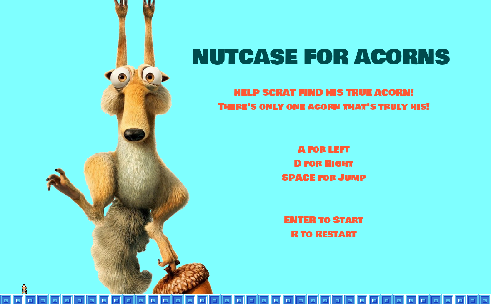

# NUTCASE FOR ACORNS

**Nutcase For Acorns** is a platformer game, built with GameMaker Studio 2, inspired by everyone's favorite saber-toothed squirrel, **Scrat**, from the _Ice Age_ franchise. Your mission is to help Scrat navigate through the harsh tundra terrain in search of his one true acorn.

## Demo

Check out this YouTube [demo](https://youtu.be/y9b9vJD8_2k) video to see **Nutcase For Acorns** in action!

## Instructions for Gameplay

Help Scrat find his **true** acorn! There's only **ONE** acorn that's truly his!

- `A` - Move Left
- `D` - Move Right
- `SPACE` - Jump
- `ENTER` - Start Game
- `R` - Restart Level

### Gameplay Tips

- **Avoid Obstacles** - Time your movements carefully on the ice and during snowstorms to dodge falling icicles and platform hazards.
- **Advance Through Levels** - Collect all the acorns and reach the top of the level to progress to the next challenge.

## Instructions for Local Use

### Option A: Run on GameMaker Studio 2

#### Prerequisites

- Install [Steam](https://store.steampowered.com/about/download) and create an active Steam account.
- Install GameMaker Studio 2 on your machine via Steam.
- Ensure all necessary dependencies are properly installed and configured within GameMaker Studio 2.

#### Steps to Run Nutcase For Acorns Locally

1. Clone this repository to your desired directory.
2. Open GameMaker Studio 2.
3. Select "Open Project" and navigate to the directory where the cloned repository is located.
4. Open the `NutcaseForAcorns.yyp` project file.
5. Run the project by clicking the play button within GameMaker Studio 2.
6. Enjoy!

### Option B: Run the Windows Build

1. Download the `NutcaseForAcornsWindows.zip` file.
2. Extract the downloaded `.zip` file.
3. Open the extracted folder and run the `NutcaseForAcorns.exe` application.
4. Enjoy!

## About

**Nutcase For Acorns** is a windy and slippery adventure where you step into the shoes of the acorn-obsessed Scrat. Inspired by the Ice Age franchise, this game captures the essence of Scrat's relentless pursuit of his coveted acorn, often filled with unexpected obstacles and comical setbacks.

With a clear vision in mind, this game features refined and intuitive gameplay, engaging visual and auditory elements, and thoughtfully designed levels that challenge players at every turn. Just like Scrat, players will experience the frustration of being so close to their most desired treasure yet facing constant hurdles that make achieving it feel just out of reach. Embrace the chaos, as each level tests your skills and patience, mimicking Scrat's own hilarious struggles in the icy world he inhabits.

Don't go nuts when playing **Nutcase For Acorns**. Remember: if you’re not slipping on ice, are you even trying to catch that acorn?

## Credits

Assets and code that I do not own are acknowledged in the [credits.md](./credits.md) file.

This project was developed using starter code and guidance provided by **Professor Blake Andrews** as part of the NYU Tandon _DM-UY 2153: Intro to Game Development_ course. Some portions of the code were adapted from the provided materials. All modifications and additional features were implemented by myself.

# Usage

While I appreciate interest in my project, please note the following:

- **Original Assets and Code**: The original artwork and code created specifically for this project are not to be used or modified without my explicit permission. If you'd like to use them, please contact me first.

- **Attribution**: If you do use any assets or code from this project that are credited to others, please ensure you follow the respective licenses and provide proper attribution.

- **Commercial Use**: This project and its original assets cannot be used for commercial purposes without my written consent.

## Contact

I’d love to hear from you! If you have any questions, feedback, or suggestions about **Nutcase For Acorns**, feel free to reach out.

    Email: eviii.professional@gmail.com

Thank you for playing **Nutcase For Acorns**!
